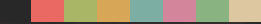
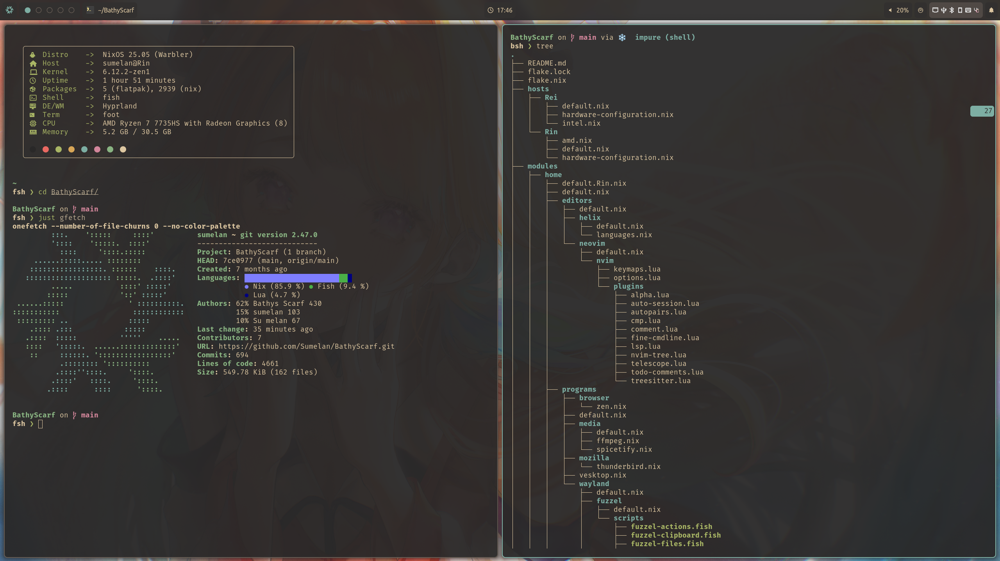
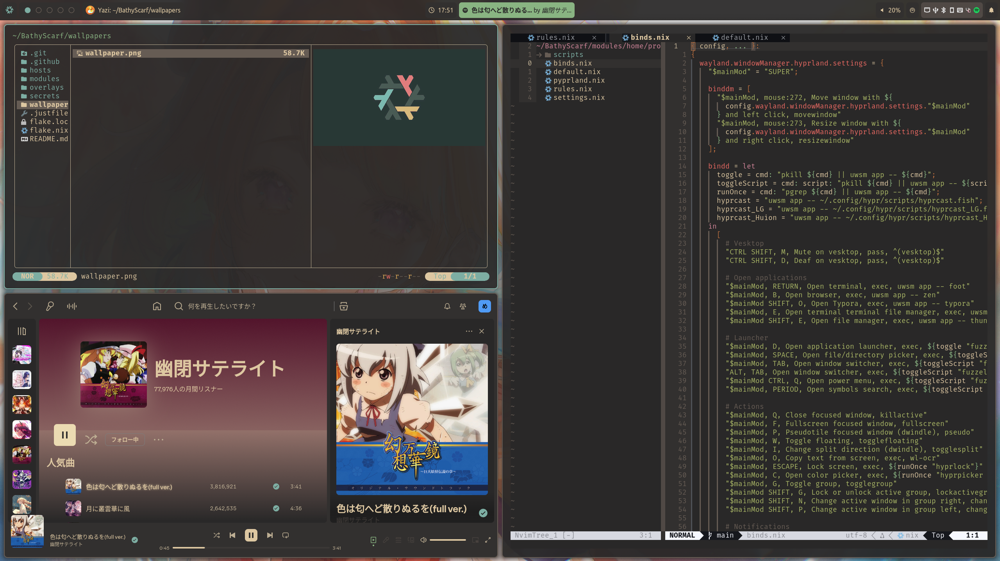
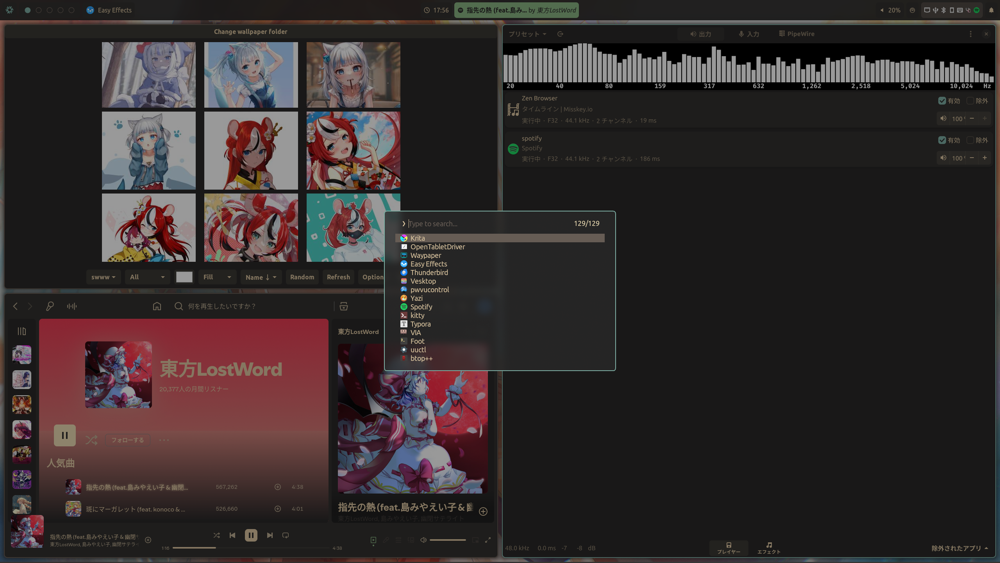

<h1 align="center">
  
   
    BathyScarf / 罰襟巻
   
  
</h1>

My flake: BathyScarf repository!  Everything wip.
- NixOS: My favorite distro.
- Hyprland: Dynamic tiling Wayland compositor.

## 🖼️ Showcase

    
    
    

# 🗃️ Overview
## 📚 Layout

- [flake.nix](flake.nix) Base of the configuration.
- [hosts](hosts/) 🌳 Per-host configurations that contain machine specific configurations.
  - [Rei / 零](hosts/Rei/) 💻 Acer Intel Laptop.
  - [Rin / 鈴](hosts/Rin/) 🖥️ Minisforum AMD Desktop.
- [modules](modules/) 🍱 modularized NixOS configurations.
  - [system](modules/system/) ⚙️ Nixos system config.
  - [home](modules/home/) 🏠 Home-manager config.
- [overlay](overlays/) 📦 Nixpkgs with overlays.
- [secrets](secrets/) 🔐 Encrypted secrets using [agenix](https://github.com/ryantm/agenix).
- [wallpapers](wallpapers/) 🌄 Default wallpaper.

## 📓 Components

|    **Window Manager**    |                 **Hyprland**                  |
| :----------------------: | :-------------------------------------------: |
|         **Bar**          |                  **Waybar**                   |
| **Application Launcher** |                  **Fuzzel**                   |
| **Notification Daemon**  |                   **Fnott**                   |
|  **Terminal Emulator**   |                   **Foot**                    |
|        **Shell**         |                   **Fish**                    |
|     **File Manager**     |             **Thunar** + **Yazi**             |
|        **Fonts**         | **FiraCode Nerd Font** + **Ubuntu Nerd Font** |
|     **Color Scheme**     |       **Gruvbox Material Dark Medium**        |
|        **Cursor**        |           **Bibata-Modern-Classic**           |
|        **Icons**         |               **Papirus-Dark**                |
|        **Browser**       |               **Zen Browser**                 |

# 👥 Credits

- [JaKooLit / Arch-Hyprland](https://github.com/JaKooLit/Arch-Hyprland)
 
    I was previously arch user and started understainding hyprland stuff from his scripts.
  
- [Tyler Kelly / ZaneyOS](https://gitlab.com/Zaney/zaneyos)

    I learned about NixOS from his config.  Plus he has a nice community on discord!
  
- [MrSom3body / dotfiles](https://github.com/MrSom3body/dotfiles/tree/main)

    Main config is copied from this repo found on /unixporn.
  
- [Frost-Phoenix / nixos-config](https://github.com/Frost-Phoenix/nixos-config)

    README.md from this repo.
